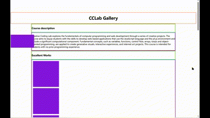
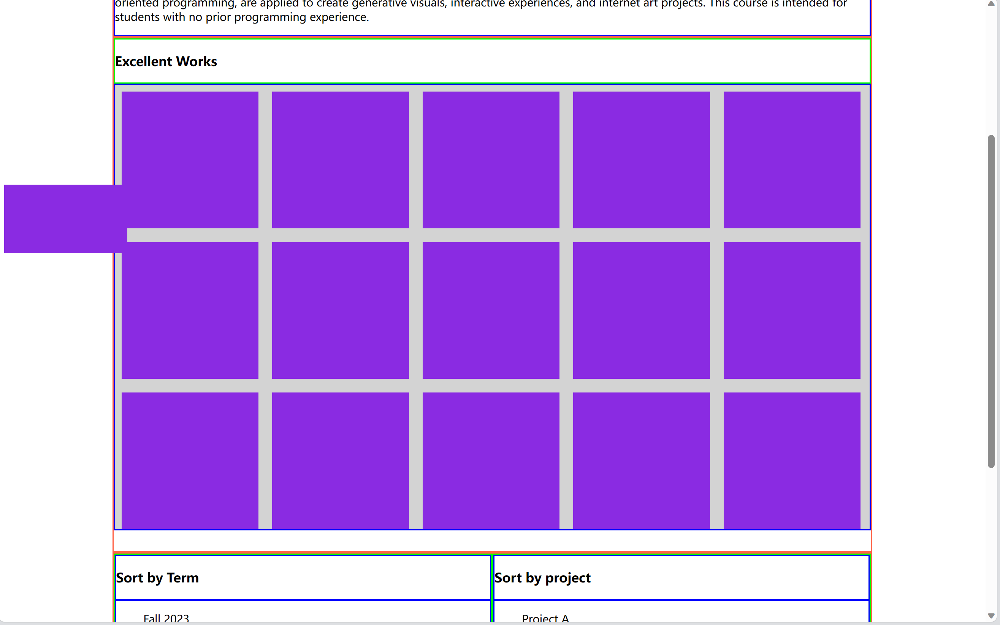

# CSS Tutorial
In this tutorial, we're going to make a webpage like this:

 

[Setup](#setup) 

[Refine Page](#refine-page)  
-> [Position elements](#position-elements)  
----> [Centering elements](#centering-elements)    
----> [Fixed position](#fixed-position--relative-position)  
----> [Flexbox](#flexbox)  
----> [Grid](#grid)  
-> [Detailed adjustments](#detailed-adjustments)  

[Recap on linking HTML element to HTML pages & adding p5 sketch to webpage](#recap-on-linking-an-element-to-different-html-pages--adding-p5js-sketch-to-webpage)

## Setup
To have a better layout in CSS, it’s essential to first build a nice structure inside your HTML file. 

What I like to do is to first sketch out the basic structure of the webpage on a piece of paper (or on my tablet) to see how I can structure my HTML file.


 
 Then, I can build the `div` structures based on this sketch like this (see code below). Make sure to give each `div` container a nice `id` or `class` name so that you can access them with ease later in the CSS file.

 ```html
 <body>
    <div id="title-container">   </div>
    <div id="logo">   </div>

    <div id="body">
        <div id="description-wrap-container">
            <div id="description-title-container"> 
            </div>
            <div id="description-container"> 
            </div>
        </div>

        <div id="workdisplay-container">
            <div id="workdisplay-title-container">   </div>
            <div id="work-container">
                <div class="img-container"></div>
                <!-- Let there be as many divs as how many images you want -->
            </div>
        </div>

        <div id="sorting-container">
            <div id="term-sort-container">
                <div id="term-title-container">
                </div>
                <div id="term-container">
                </div>
            </div>
            <div id="project-sort-container">
                <div id="project-title-container">
                </div>
                <div id="project-container">
                </div>
            </div>
        </div>
	</div>

    <div id="bottom-container">   </div>
</body>
 ```
In the corresponding CSS file, I like to first give all the `div`s a `border` or a `background-color` and a certain `height` as well as `margin` (if needed) to be able to see the outcome of the `div`s that I've coded so far.

```css
/* -----TITLE----- */
#title-container {
    border: 2px solid tomato;
    height: 20px;
}

#logo {
    background-color: blueviolet;
    border: 2px solid tomato;
    width: 180px;
    height: 100px;
}

/* -----BODY----- */
#body {
    width: 80%;
}

/* -----DESCRIPTION----- */
#description-wrap-container {
    border: 2px solid tomato;
    height: 50px;
}

#description-title-container {
    border: 2px solid lime;
    height: 20px;
}

#description-container {
    border: 2px solid blue;
    height: 30px;
}

/* -----WORK DISPLAY----- */
#workdisplay-container {
    border: 2px solid tomato;
    height: 600px;
}

#workdisplay-title-container {
    border: 2px solid lime;
    height: 100px;
}

#work-container {
    border: 2px solid blue;
    height: 500px;
}
.img-container {
    background-color: blueviolet;
    width: 200px;
    height: 200px;
    margin: 10px;
}

/* -----SORTING LISTS----- */
#sorting-container {
    border: 2px solid tomato;
}

/* --TERM LISTS-- */
#term-sort-container {
    border: 2px solid lime;
    width: 50%;
    height: 30px;
}

#term-title-container {
    border: 2px solid blue;
    height: 10px;
}

#term-container {
    border: 2px solid blue;
    height: 10px;
}

/* --PROJECT LISTS-- */
#project-sort-container {
    border: 2px solid lime;
    width: 50%;
    height: 30px;
}

#project-title-container {
    border: 2px solid blue;
    height: 10px;
}

#project-container {
    border: 2px solid blue;
    height: 10px;
}

/* -----BOTTOM CONTAINER----- */
#bottom-container {
    height: 200px;
}
```
With the above code, we can see a page like this:  


*Note:*
- *I colorcoded all the parts based on its level and type inside the html file (e.g. the largest containers `title-container`, `logo`, and `body` all have the red borders; all images, including the `logo` and the `img-container`, all have purple backgrounds).*
- *the `#bottom-container` is just there to make sure that there's some space at the bottom to look better.*

Now let's put the text we want into the page (namely, the texts for the title of the page, the course description section, and the sorted sections). I thus add the text inside the `div` of these sections in the HTML file.

```html
<!-- ... -->
<div id="title-container">
    <h1>CCLab Gallery</h1>
</div>
<!-- ... -->
<div id="description-title-container">
    <h3 id="description-title">Course description</h3>
</div>
<!-- ... -->
<div id="description-container">
    <p id="description">Creative Coding Lab explores the fundamentals of computer programming and web development through a series of creative projects. The course aims to equip students with the skills to develop web-based applications that use the JavaScript language and the p5.js environment and include a significant computational component. Fundamental concepts, such as variables, functions, control flow, arrays, loops and object-oriented programming, are applied to create generative visuals, interactive experiences, and internet art projects. This course is intended for students with no prior programming experience.</p>
</div>
<!-- ... -->
<div id="workdisplay-title-container">
    <h3>Excellent Works</h3>
</div>
<!-- ... -->
<div id="workdisplay-title-container">
    <h3>Excellent Works</h3>
</div>
<!-- ... -->
<div id="term-title-container">
    <h3>Sort by Term</h3>
</div>
<div id="term-container">
    <ul>Fall 2023</ul>
    <ul>Spring 2023</ul>
    <ul>Fall 2022</ul>
    <ul>Spring 2022</ul>
    <ul>...</ul>
</div>
<!-- ... -->
<div id="project-title-container">
    <h3>Sort by project</h3>
</div>
<div id="project-container">
    <ul>Project A</ul>
    <ul>Project B</ul>
    <ul>Drawing with code</ul>
    <ul>Interactive drawing</ul>
    <ul>...</ul>
</div>

```
Simultaneously, let's also comment out all the heights we set previously for these `div`s in the CSS file to make full use of the default height of these texts (but of course you can customize them according to your preference, which we will take about later).
What we get then is this:  


We're completed with our set up! Now let's dive into CSS file to make the page looks more refine ✨

## Refine page

### Position elements
First of all, I'd like to first position each `div` in the desired position.
- I'd like the title and the whole page centered on the page, instead of staying at the very left; 
- I'd like the logo to be fixed at a spot of the page as I scroll, instead of ownly below the title;
- I'd like all the images in the "gallery" to appear in grid, instead of vertically aligned on top of each other
- I'd also like all "sort by term" and "sort by project" section to be displayed side by side, instead of vertically aligned

Let's get started!

#### *Centering elements*
To center a block element (like `div`) horizontally, we can simply use  `margin: auto`.  
**But note: `margin: auto` doesn't work if the width is not set or set to 100%.*  

Thus, to put the body of the page (`#body`) in the center, we need to both set the width of it according to a preferred design, and also give it a `margin: auto`. In the code, we write:
```css
#body {
    width: 1110px;
    margin: auto;
}
```
Now we get:  


In addition to centering a block element, we can also easily center a text (titles like `<h1>`, `<p>`, etc.). Here, I'd like to center the title CCLab Gallery, which is in a `h1` inside a `div` whose id is named as `#title-container` in the HTML file.  
To center a text element, we can use `text-align: center` in the CSS file.
```css
#title-container h1 {
    text-align: center;
}
``` 
**Note:*  
*The selector `#title-container h1{}` here refers to the `<h1>` tag inside the `div` element called `title-container` specifically. Similar syntax could be used if you'd like to refer to a particular element without any id or class inside a specific element with one.*  
*You could also use `h1{}` as the selector here since the title is the only element that uses `<h1>`*

Then the title is successfully alligned in the center!


More information on centering elements can be found [here](https://www.w3schools.com/css/css_align.asp 'W3School tutorial on "CSS Layout - Horizontal & Vertical Align"'). 

#### *Fixed position (& relative position)*
Now lets try to make the logo fix at a certain location as it floats.  
What we're going to use here is `position: fixed`, a declaration that fix the element at the position in relation to your screen instead of the entire web page, no matter how you scroll or resize the screen.  
We thus first give it a position, and then tell it to fix the position with `position: fixed` like this:  
```css
#logo {
    width: 180px;
    height: 100px;
    position: fixed;
    top: 30%;
}
```


Same technique could also be used if you want to have certain text to fix at certain position, while in the back, some fantastic images fly by as you scroll, or vise versa.  

  
For example, like this website [Our Planet Is Choking on Plastic](https://www.unep.org/interactives/beat-plastic-pollution/) from UNEP.

#### *Flexbox*
Now it's time to make the two sorting blocks ('sort by term' and 'sort by projects') align with each other horizontally instead of vertically.  
To do this, I introduce the *flexbox*.

The flexbox is a sort of layout that could help us fit different sizes of items in a container efficiently. It can automatically alter the items' height/width to best fit everything inside a given space. It is especially useful when you want the items to shift layout when screen sizes or devices change.  
More information on flexbox can be found in [Chris Coyier's Tutorial 'A Complete Guide to Flexbox'](https://css-tricks.com/snippets/css/a-guide-to-flexbox/ "A Complete Guide to Flexbox")

Here, I use one of the most basic property of flexbox to break the default layouts (vertical for block and horizontal for inline), which is that flexbox enables us to choose either to align elements vertically or horizontally.

Thus, to reorganize the two `div`s for these to blocks, we simply add `display: flex`, which automatically brings the two blocks together side by side.  
```css
#sorting-container {
    display: flex;
}
```  
Now the two blocks look like this:  
  
**Note:*  
- *We don't need to specify the direction here because flexbox makes items align horizontally by default. If you'd like to make it vertically again, you can add `flex-direction: column`.*
- *Be mindful that this `display: flex` should be put in the larger container of the two or more items that you want to change layout with (e.g. here I put it inside `#sorting-container`, which is the parent container of `#term-sort-container` and `#project-sort-container`).*


#### *Grid*
Now it's time to bring the blocks for all the excellent works back in the HTML file!  
I have 15 blocks of `.image-container` in total in the larger container `#work-container`.
```html
<div id="work-container">
    <div class="img-container"></div>
    <div class="img-container"></div>
    <div class="img-container"></div>
    <div class="img-container"></div>
    <div class="img-container"></div>
    <div class="img-container"></div>
    <div class="img-container"></div>
    <div class="img-container"></div>
    <div class="img-container"></div>
    <div class="img-container"></div>
    <div class="img-container"></div>
    <div class="img-container"></div>
    <div class="img-container"></div>
    <div class="img-container"></div>
    <div class="img-container"></div>
</div>
```
Without any styling in CSS, it now looks like this:  
  
It is quite terrifying with such a long list of purple rectangles aligning vertically on top of each other! But no worries, we fix it with a very simple line of code by using *Grid* layout.

The *Grid* layout is slightly more sophisticated than flexbox in that it's a two-dimensional grid-based system, whose outcome is quite similar to what you see in the table function of a word document. It can also work with the *Flexbox* to create even more advanced layout!  
More about grid can be found in Chris House's tutorial [A Complete Guide to CSS Grid](https://css-tricks.com/snippets/css/complete-guide-grid/ 'A Complete Guide to CSS Grid').

Here for this page, I'd like to create a grid with 5 columns and 3 rows.  
We first need to initialize our display mode as grid with `display: grid`.
```css
#work-container {
    display: grid;
}
```
Then, we specify how we want the grid to look like: width/height of each grids, how many columns/rows.  
The syntax would be:
```css
.container{
    grid-template-columns: ... ...;
    /* e.g. 
      1fr 1fr
      minmax(10px, 1fr) 3fr
      repeat(5, 1fr)
      50px auto 100px 1fr
    */
    grid-template-rows: ... ...;
}
```  
For me, it's 5 columns and 3 rows, and both width and heights are 200px. And because all of its width and heights are the same, I can simply use `repeat(5, 200px)` (syntax: `repat(amount, length)`) for the colomns, and the rest will automatically fit.   
This is everything needed to make a 5 by 3 grid with 15 blocks:  
```css
#work-container {
    display: grid;
    grid-template-columns: repeat(5, 220px);
}
```
Now we can see that all 15 blocks are put into the container in a 5 by 3 table:  
  

---  
Now we've got the general layout done for the website!  

    


### Import all images and links

With the genral layout all set, we can now import our images/gifs/videos/website links into the website!  
Here, for clearer demonstration, I will focus on the layout of the images.  

A little recap on adding image to HTML file, we use the `` tag, and put it in the `div` that you want the image to be.
```css
<div id="logo">
    
</div>
```
Without any styling in CSS, we'll see the image whose left top corner is positioned correctly in the desired block, but size much smaller/bigger than what we want (the size the image originally).  

  

We can simply limit the maximum size of the image to be the same as its container with `max-width` and `max-height`.
```css
#logo img {
    max-width: 100%;
    max-height: 100%;
}
```
**Note:*
- *the 100% refers to the height and width of its container (default in CSS)*  
- *The image will also resize proportionally.*

Now we have this:  
  

For the images in the "Gallery", we put the `` inside each image container like before.  
(For simplicity and copyrights' sake I just used images from my own past projects and duplicated.)  

However, the resize is a little different comparing to the logo. Unlike the logo that only requires neither the maximum of the height nor the width be bigger than the height and width of its container, the images in the "gallery" requires every image to be strictly within each square, regardless of its ratio.  
Thus, we use a slightly different property called `object-fit`. With different values like `fill`, `cover`, `contain`, `none`, and `scale-down`, the `object-fit` property can help us resize and crop image as we like.  
Here, to limit the image inside each square container without changing its aspect ratio, we can use the `object-fit: cover` to achieve that.  
More about `object-fit` can be found in Alligator.io's Tutorial ["How To Scale and Crop Images with CSS object-fit"](https://www.digitalocean.com/community/tutorials/css-cropping-images-object-fit "How To Scale and Crop Images with CSS object-fit").
```css
.img-container img{
    width: 100%;
    height: 100%;
    object-fit: cover;
}
```
**Note: the `width: 100%` and `height: 100%` are needed to tell the width and height that you want it to adapt to.*  


Now we're finished with adding all the elements into the webpage. We're ready for some final detailed adjustments!

### Detailed adjustments
Let's first get rid of all the borders and backgrounds that we made before and take a close look at the general layout.  


I'm a little unsatisfied with the logo blocking the texts and images. I thus decrease the width of the `#body` container a little bit (from 80% to 75%).

```css
#body {
    width: 75%;
    margin: auto;
}
```
I also think that the webpage is a little two white, thus, I added a gentle gackground color to it.
```css
body {
    background-color: rgb(248, 205, 189);
}
```

Similarly, when working on your own project, it's always helpful to make some final detailed adjustments (*such as font changes, color, width/height, margin/padding, etc.*) after finishing up to polish your project 🤗 


## Recap on linking an element to different HTML pages & adding p5.js sketch to webpage
### HTML element to another HTML page
To link an HTML element to another HTML page, what we need is just a simple anchor tag `<a href="filepath">text with link</a>`.  
Here on this webpage, we'll link another HTML file called `project_a.html` to the "Project A" text in the "Sort by project" section.  
```html
<div id="project-container">
    <ul><a href="project_a.html">Project A</a></ul>
    <!-- ... -->
</div>
```
Now, the "Project A" text is successfully linked to the `project_a.html` webpage.


### Adding p5.js to webpage
Let's first create javascript file called `script.js` tp a new folder called `js`.  
  

Then we link the javascript file with the `project_a.html` HTML page by adding the tag `<script src="filepath" type="text/javascript"> </script>`.
```html
<body>
    <script src="js/script.js" type="text/javascript"></script>  
</body>
```
To add the p5.js, we first put the downloaded p5.js library file to the js folder.

  
And let's also add the `script` tag to the `<head> </head>`.
```html
<head>
    <script src="js/lib/p5.js" type="text/javascript"></script>
</head>
```
Finally, let's add some p5.js code into the `script.js` file and see the final outcome!

 

---
Congratulations! We've made a website with some tricks using CSS 🥳 

 
